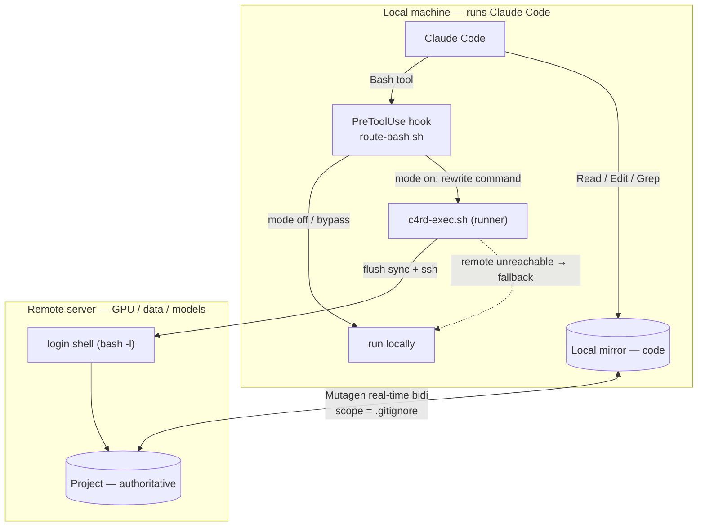

# Claude4RemoteDEV

**English** | [简体中文](README.zh-CN.md) · [Background & manual method](docs/remote-claude.md)

Run **Claude Code on your local/near machine, execute on a remote GPU/dev server.** Your code, data,
models and GPUs live on the remote; Claude edits a local mirror (instant Read/Edit/Grep) and its
Bash commands are transparently forwarded to the remote over SSH. Files stay in **real-time
two-way sync** via [Mutagen](https://mutagen.io). Inspired by
[langwatch/claude-remote](https://github.com/langwatch/claude-remote).

Typical setup: a machine **B** that can run Claude Code drives a GPU server **C** where everything
real lives — even across a slow/cross-border link.

## Why

Claude Code's file tools only touch the machine it runs on, and mounting a remote FS (SSHFS) makes
every read/grep a network round-trip. Instead: keep a **local code mirror** (native-speed editing),
**sync it** to the remote, and **forward command execution** to the remote. Big data/models never
come local.

## How it works

```
Claude (local) ──Bash tool──▶ PreToolUse hook (route-bash.sh)
                                 mode off / bypass → run locally, unchanged
                                 mode on  → rewrite to: c4rd-exec.sh <base64(cmd)>
                                              │ flush sync, map cwd→remote, ssh → remote login shell
                                              │ unreachable → run locally (fallback + warning)
Read/Edit/Grep/Glob ──▶ local mirror  ⇄⇄ Mutagen real-time bidi sync ⇄⇄ remote (authoritative)
```



- **Interception** uses Claude Code's officially-supported `PreToolUse` hook (`updatedInput`), not a
  shell replacement — so it's robust across versions.
- **Sync scope is driven by `.gitignore`** (single source of truth for both git and Mutagen). Big/
  generated dirs listed there stay only on the remote.
- **Default OFF** ("wraps, not activates") — a fresh install passes through locally until you
  `/claude4remotedev on`.

## Requirements

- Claude Code, `ssh`, `jq`, `rsync` on the local machine; SSH access to the remote (key-based).
- [Mutagen](https://mutagen.io) on the local machine (`brew install mutagen-io/mutagen/mutagen`, or
  download the Linux binary — setup.sh prints the command).

## Install

```bash
git clone https://github.com/cuiwenyao/Claude4RemoteDEV ~/Claude4RemoteDEV
cd /path/to/your/project           # the project you want to develop
~/Claude4RemoteDEV/setup.sh        # interactive; --gen-key to create an SSH key
```

`setup.sh` will: (optionally) generate an SSH key and copy it to the remote, add a `Host` block to
`~/.ssh/config` (ControlMaster multiplexing), install scripts to `<project>/.claude/c4rd/`, register
the `PreToolUse` hook in `<project>/.claude/settings.json`, install the `/claude4remotedev` skill, and
start Mutagen sync.

Non-interactive:
```bash
~/Claude4RemoteDEV/setup.sh --project ~/proj --gen-key --yes \
  --remote-host gpu.example.com --remote-user ubuntu --port 22 \
  --remote-root /home/ubuntu/proj --mirror ~/proj --alias gpu --session c4rd-proj
```

## Use

```bash
cd ~/proj && claude
```
Then in Claude:
- `/claude4remotedev on` — turn on remote execution (next command runs remotely; no restart).
- `/claude4remotedev status` — show mode, reachability, sync state.
- `/claude4remotedev off` — back to local.

Now just work normally: edit files (they sync), and any command Claude runs executes on the remote.
Long jobs go in a remote tmux; read remote-only results with `.claude/c4rd/cpull <relpath>`.

## Commands (in `<project>/.claude/c4rd/`)

| Command | Purpose |
|---|---|
| `sync-start.sh` | create/ensure the Mutagen session (scope from `.gitignore`) |
| `sync-stop.sh` | stop the session |
| `sync-status.sh` | mode + reachability + sync state |
| `resync` | rebuild sync scope after editing `.gitignore` |
| `c '<cmd>'` | manually run a command on the remote (works even when routing is off) |
| `cpull <relpath>` | fetch remote-only results (excluded from sync) into the mirror |
| `install-daemon-service.sh` | enable the Mutagen daemon as a systemd service (boot autostart) |

Repo root: `setup.sh` (install), `uninstall.sh --project <dir>` (safe removal — terminates sync first).

## Sync scope = `.gitignore`

Everything under the project syncs **except** what `.gitignore` matches (plus `.git` and symlinks).
Put large/generated things there (`/data/`, `/.venv*/`, `/logs/`, `*.pt`, `*.ckpt`, …). After editing
`.gitignore`, run `.claude/c4rd/resync`. **New large output dirs must be added before they can fill
the local disk.** A file you want local-only (never synced, never committed) also goes in `.gitignore`.

When the local mirror is a **fresh empty directory** and the remote is an existing project,
`sync-start` **seeds `.gitignore` from the remote's** automatically, so the remote's big dirs are
excluded on the very first sync. If neither side has a `.gitignore`, it **refuses** to create a
wide-open sync (which could pull the whole remote and fill your disk) — create one first.

## Config

`<project>/.claude/c4rd/config.sh` (generated). Notable: `REMOTE_PATH_FIX` — the PATH export used in
the remote login shell so tools like `uv`/`conda` are found (adjust to your remote). If you set
`MIRROR_ROOT` equal to `REMOTE_ROOT` (same absolute path both sides), remote paths in output are valid
locally and no path rewriting is done.

## Toggle precedence

`state/session-<id>` > `state/mode` (project) > default `off`. Fail-safe: any value other than exactly
`on` routes locally.

## Safety: deleting the local folder cannot wipe the remote

This is enforced by mechanism, not just by convention:

- **Deleting the whole local folder — or emptying its contents — does NOT delete the remote.** Mutagen's
  two-way-safe mode (pinned by `sync-start`) **halts** the session on either catastrophe
  (`Halted due to root deletion` / `Halted due to one-sided root emptying`) instead of propagating it.
  The daemon **never auto-propagates a mass deletion** — verified: `rm -rf project` (with or without
  recreating an empty dir), left to the daemon, leaves the remote fully intact.
- The only ways the remote can actually lose content: (a) deleting **some** files while others remain
  (normal editing — it propagates, and remote `.git` recovers it), or (b) **manually** forcing a
  halted session (`mutagen sync flush`/`resume`) — a deliberate override, not an accident. As a guard,
  `c4rd`'s automatic pre-command flush is **skipped whenever the session is halted**, so the tool
  itself can never turn an accidental delete into a remote wipe.
- **Recovery after such a delete**: `sync-start` detects the halted session and **rebuilds it fresh**,
  which repopulates the local mirror **from** the remote (initial sync never deletes remote content).
  So you get your files back and the remote is untouched.
- **Ignored paths are never touched.** Everything matched by `.gitignore` (big `data/`, models,
  `.venv*`, `.tools/`, …) is outside sync entirely — deleting the mirror can never affect them.
- **Clean teardown**: `./uninstall.sh --project <dir>` terminates the session *first*, so any later
  folder deletion is decoupled from the remote. Add `--purge` to also delete the local dir.

Residual case: deleting *individual files* while the root remains is normal editing and **does**
propagate (that's intended — removing a source file should remove it on the remote). The remote keeps
`.git`, so those are recoverable via git.

## Troubleshooting

- **Commands still run locally after `on`**: confirm the hook is in `settings.json`
  (`.hooks.PreToolUse[].hooks[].command`), and that `jq` is installed. Restart is not needed (hooks
  hot-reload), but re-open the skill status to verify.
- **`uv`/`conda` not found on remote**: edit `REMOTE_PATH_FIX` in `config.sh`.
- **Sync huge / disk filling**: a big dir isn't ignored — add it to `.gitignore` and `resync`.
- **Hangs after network change**: `rm ~/.ssh/cm-c4rd-*` to clear stale control sockets.
- **Verify install**: `~/Claude4RemoteDEV/tests/smoke.sh --project ~/proj`.

## Uninstall

Remove the `PreToolUse` entry from `<project>/.claude/settings.json`, delete `<project>/.claude/c4rd/`
and `<project>/.claude/skills/claude4remotedev/`, and `mutagen sync terminate <session>`.

## Docs

- [简体中文 README](README.zh-CN.md)
- [docs/remote-claude.md](docs/remote-claude.md) — background and the underlying **manual** method
  (SSH + Mutagen + `c` helper) this toolkit automates; useful for understanding and customizing.

## License

MIT.
