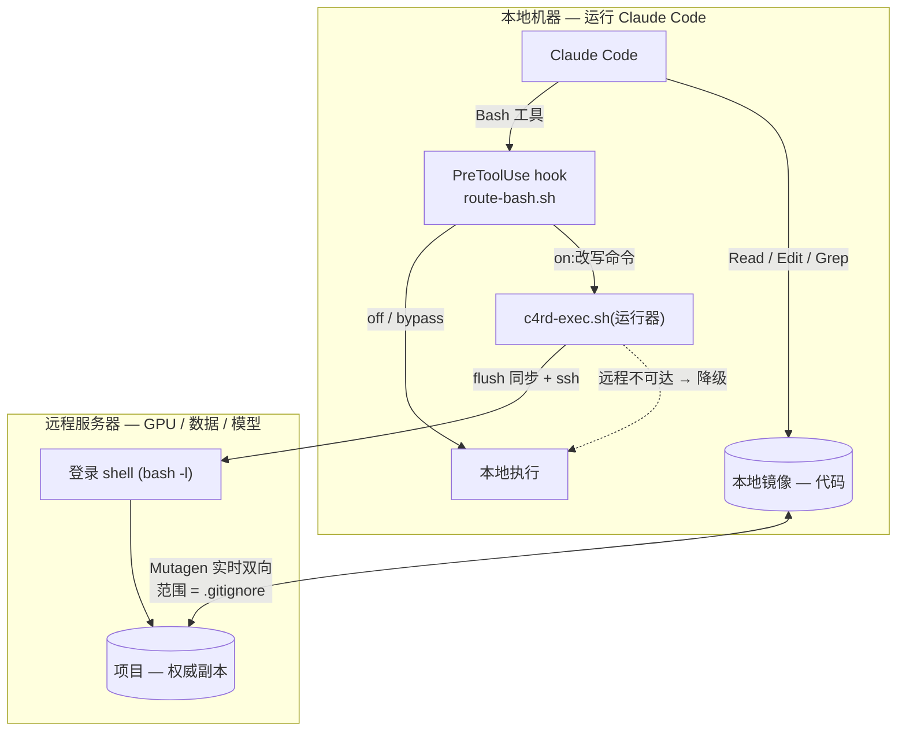

# Claude4RemoteDEV

[English](README.md) | **简体中文** · [背景与手动方法](docs/remote-claude.md)

**让 Claude Code 跑在本地机器,把代码执行放到远程 GPU/开发服务器上。** 代码、数据、模型、GPU 都在远程;
Claude 编辑一份本地镜像(Read/Edit/Grep 原生秒开),它的 Bash 命令则透明地经 SSH 转发到远程执行。
文件用 [Mutagen](https://mutagen.io) 保持**实时双向同步**。灵感来自
[langwatch/claude-remote](https://github.com/langwatch/claude-remote)。

典型场景:一台能运行 Claude Code 的机器 **B** 驱动 GPU 服务器 **C**(哪怕是跨境/高延迟链路)。

## 为什么

Claude Code 的文件工具只作用于它所在的机器;而把远程盘挂过来(SSHFS)会让每次读/grep 都变成一次网络往返。
本方案改为:在本地留一份**代码镜像**(原生速度编辑)、把它**同步**到远程、把**命令执行转发**到远程。大数据/模型永不落地本机。

## 工作原理



- **拦截**用 Claude Code 官方支持的 `PreToolUse` hook(`updatedInput` 改写命令),不是替换 shell,跨版本更稳。
- **同步范围由 `.gitignore` 决定**(git 与 Mutagen 的唯一事实来源),其中列出的大目录/生成物只留在远程。
- **默认关闭**(wraps-not-activates):刚装完是本地直通,直到你 `/claude4remotedev on`。

## 依赖

- 本地:Claude Code、`ssh`、`jq`、`rsync`;对远程有基于密钥的 SSH 访问。
- 本地装 [Mutagen](https://mutagen.io)(`brew install mutagen-io/mutagen/mutagen`,或下载 Linux 二进制 —— setup.sh 会打印命令)。

## 安装

```bash
git clone https://github.com/cuiwenyao/Claude4RemoteDEV ~/Claude4RemoteDEV
cd /path/to/your/project           # 你要开发的项目
~/Claude4RemoteDEV/setup.sh        # 交互式;--gen-key 可自动生成 SSH 密钥
```

`setup.sh` 会:(可选)生成 SSH 密钥并装到远程 → 幂等写入 `~/.ssh/config`(ControlMaster 连接复用)→
把脚本装到 `<project>/.claude/c4rd/` → 在 `<project>/.claude/settings.json` 注册 `PreToolUse` hook →
安装 `/claude4remotedev` skill → 启动 Mutagen 同步。

非交互:
```bash
~/Claude4RemoteDEV/setup.sh --project ~/proj --gen-key --yes \
  --remote-host gpu.example.com --remote-user ubuntu --port 22 \
  --remote-root /home/ubuntu/proj --mirror ~/proj --alias gpu --session c4rd-proj
```

## 使用

```bash
cd ~/proj && claude
```
在 Claude 里:
- `/claude4remotedev on` —— 开启远程执行(下一条命令即生效,无需重启)。
- `/claude4remotedev status` —— 查看模式、可达性、同步状态。
- `/claude4remotedev off` —— 回到本地执行。

之后照常干活:编辑文件(自动同步),Claude 跑的任何命令都在远程执行。长任务放远程 tmux;
读远程独有的结果用 `.claude/c4rd/cpull <相对路径>`。

## 命令(位于 `<project>/.claude/c4rd/`)

| 命令 | 作用 |
|---|---|
| `sync-start.sh` | 创建/确保 Mutagen 会话(范围读 `.gitignore`) |
| `sync-stop.sh` | 停止会话 |
| `sync-status.sh` | 模式 + 可达性 + 同步状态 |
| `resync` | 改完 `.gitignore` 后重建同步范围 |
| `c '<cmd>'` | 手动在远程跑命令(即使 routing 关着也能用) |
| `cpull <相对路径>` | 把远程独有(被排除同步)的结果拉回镜像 |

## 同步范围 = `.gitignore`

项目下的一切都同步,**除了** `.gitignore` 命中的内容(外加 `.git` 与符号链接)。把大/生成物放进去
(`/data/`、`/.venv*/`、`/logs/`、`*.pt`、`*.ckpt` …)。改完 `.gitignore` 跑 `.claude/c4rd/resync`。
**新增大产出目录务必先加进 `.gitignore`**,否则会往本机传、可能撑爆磁盘。想「只留本地、不同步不提交」的文件也放进 `.gitignore`。

当本地镜像是**全新空目录**、而远程是已存在的项目时,`sync-start` 会**自动从远程拉取它的 `.gitignore`** 作为同步范围,
这样首次同步就会正确排除远程的大目录。若两端都没有 `.gitignore`,它会**拒绝**创建全量同步(避免把整个远程拉爆本机磁盘)——请先建一个。

## 配置

`<project>/.claude/c4rd/config.sh`(生成)。重点:`REMOTE_PATH_FIX` —— 远程登录 shell 里的 PATH 修复,
让 `uv`/`conda` 等可见(按你的远程调整)。若把 `MIRROR_ROOT` 设成和 `REMOTE_ROOT` 完全相同的绝对路径,
远程输出里的路径在本地也有效,就无需路径回写。

## 开关优先级

`state/session-<id>` > `state/mode`(项目级) > 默认 `off`。失败安全:凡不是恰好等于 `on` 都走本地。

## 安全:删本地文件夹不会清空远程

这是**机制保证**,不只是约定:

- **删掉整个本地文件夹、或清空其内容,都不会删远程。** Mutagen 的 two-way-safe 模式(`sync-start` 已固定)
  遇到这两种灾难都会**halt**(`Halted due to root deletion` / `Halted due to one-sided root emptying`),
  而不传播。**守护进程绝不会自动传播整目录删除**——已实测:`rm -rf project`(无论是否重建空目录),
  交给守护进程自己跑,远程始终完好。
- 远程真正会丢内容只有两种途径:(a) 删**部分**文件、其余保留(正常编辑,会传播,远程 `.git` 可恢复);
  (b) **手动**对已 halt 的会话强制 `mutagen sync flush`/`resume`(刻意越过保护,非意外)。作为保险,
  `c4rd` 每条命令前的自动 flush 在**会话 halt 时会跳过**,所以工具本身绝不会把误删变成远程清空。
- **事故恢复**:`sync-start` 检测到 halt 会话会**安全重建**,从远程把本地镜像**拉回来**(初次同步从不删远程内容)。
  于是文件失而复得,远程毫发无损。
- **被忽略的路径从不参与**:`.gitignore` 命中的一切(大 `data/`、模型、`.venv*`、`.tools/` …)完全在同步之外,
  删镜像也动不了它们。
- **干净卸载**:`./uninstall.sh --project <dir>` 会**先终止会话**,之后再删文件夹就与远程解耦了。加 `--purge` 连本地目录一起删。

残留情形:根目录还在、只删**单个文件**属于正常编辑,**会**传播(这是应该的——删源码文件就该在远程也删)。
远程有 `.git`,这类删除可用 git 恢复。

## 排错

- **`on` 后命令仍在本地跑**:确认 `settings.json` 里有 hook(`.hooks.PreToolUse[].hooks[].command`)且装了 `jq`。
  无需重启(hook 热加载),用 skill 的 status 复核即可。
- **远程 `uv`/`conda` 找不到**:改 `config.sh` 里的 `REMOTE_PATH_FIX`。
- **同步过大/磁盘将满**:有大目录没被忽略 —— 加进 `.gitignore` 再 `resync`。
- **换网后卡住**:`rm ~/.ssh/cm-c4rd-*` 清理陈旧的复用连接 socket。
- **验证安装**:`~/Claude4RemoteDEV/tests/smoke.sh --project ~/proj`。

## 卸载

删掉 `<project>/.claude/settings.json` 里的 `PreToolUse` 那条,删除 `<project>/.claude/c4rd/` 与
`<project>/.claude/skills/claude4remotedev/`,并 `mutagen sync terminate <session>`。

## 许可证

MIT。
